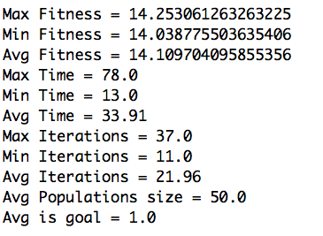
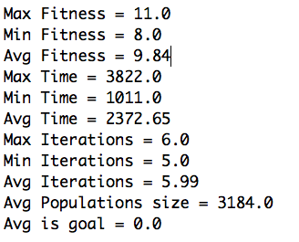
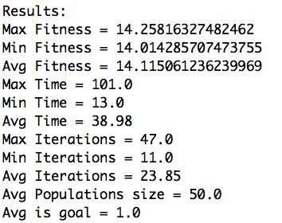
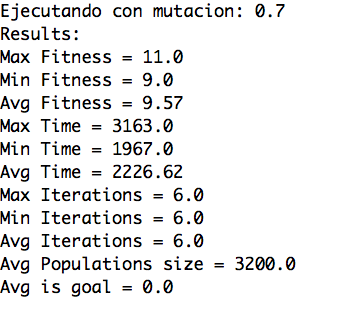
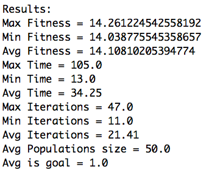
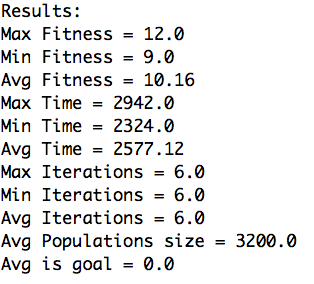
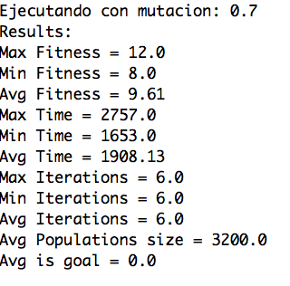
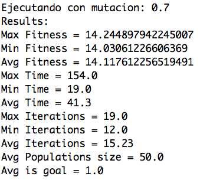

Miguel Salazar, Andrea Markus Gentile Grupo 27

##Practica #4

1. Descripción de como habéis representado los individuos.

	   Hemos representado los individuos a travès de una clase ***Profesor*** que tiene 3 parametros:
	   
	   1. el nombre del profesor
	   2. una lista de restricciones 
	   3. una lista de preferecias

	    
2. Descripción de la generación de población inicial.
	
	La poblaciòn iniciàl es generada aleatoriamente tenenedo en cuenta el numero de turnos necesario en el problema que estamos intentando resolver.
	De esa manera empazomos con una poblaciòn inicial cuyo numero de turnos asignados es lo màs cerca posible al numero de turnos de asignar objetivo. 
	
3. Descripción de la implementación del operador de cruce que habéis realizado.

	No hemos modificado la implementaciòn de cruze utilizada en la libreria aima.
	Hemos modificado la funciòn *nextGeneration* para que anade dos hijos en lugar de uno. Los dos hijos creados son creados utilizando el mismo punto de cruze invirtiendo las dos cabezas con las dos colas. 


4. Descripción de la implementación del operador de mutación que habéis
realizado.

	Hemos modificado la implementaciòn de mutación utilizada en la libreria aima para elegir aleatoriamente un profesor entre los profesores de la lista que violaban una restriccion. 
	De esa manera es màs probable que la mutaciòn genera un individuo mas adapta a ser una soluciòn. Si no hay profesores que violan una restricciòn entonces elige aleatoriamente cualquier profesor de la lista.
	
5. Descripción de la función de fitness empleada en vuestra implementación.

	La funciòn de fitness que creamos empeza analizando dos factores para alcanzar una soluciòn valida:
	
		1. El numero de profesores que trabajan tiene que ser lo màs cerca posible del numero de turnos que se necesitan.
		2. El numero de restricciones incumplidas tiene que ser lo mas bajo posible. 

		
	Cuandoo tenemos una soluciòn valida (y entonces el valor de fitness vale cuanto el numero de personas que deben trabajar) anadimos un numero entre 0 y 1.
	Este numero compuesto de dos partes:
			
		1. Las preferencias respetadas. Vale 0.3 del valor total anadido. Si todas las preferencias son respetadas vale 0.3 y si ninguna lo es vale 0.
		2. El equilibrio entre los profesores asignados. Vale 0.7 del valor total anadido. Si hay un equilibrio perfecto vale 0.7. Si solo trabaja una persona vale 0.
		
	Elegimos dar mas peso a el equilibrio respeto a las prferencias porque en nuestra opinion es un criterio bonus mas importante respeto a las preferencias. De esta manera es menos probable que el algoritmo eliga una soluciòn donde solo hay una persona trabajando que todavia seria valida. 
	
	

6. Descripción de la función objetivo empleada en vuestra implementación.

	La funciòn objetivo es parecida a la primera parte de la funciòn de fitness. Entonces si el numero de trabajadores es corecto y no hay violaciones de las restricciones entonces devuelve true. Si no devuelve false.

7. Resultados obtenidos por el algoritmo desarrollado para las configuraciones
proporcionadas.

Para poder analizar la eficiencia del algoritmo no basta con ejecutar una única vez el algoritmo, habrá que ejecutarlo varias veces (100, por ejemplo) y de cada parámetro (fitness mejor individuo, tiempo de ejecución...) obtener media, máximo...

***Datos relativos al fichero configuracionConvocatoria2.txt***

Resultados con generaciòn de un hijo y mutaciòn con probabilidad de 0,8.

Resultados con generaciòn de dos hijos y mutaciòn con probabilidad de 0,8.

Se puede ver que utilizando dos hijos el algoritmo tiene un rendimiento mucho peor que utilizando solo un hijo. 
Esto es porque la talla de la poblaciòn crece exponencialmente y no es posible iterar muchas veces el algoritmo genetico. Esto no nos permite explotar el verdadero potencial de los algoritmos geneticos.
Entonces por eso ninguna de las cien veces obtenemos una soluciòn valida. 

En la primera imagen podemos ver que el algoritmo siempre encuentra una soluciòn y tambièn muy rapidamente (max 78 milisegundos).

La pequena diferencia entre los valores de fitness de las soluciones òptimas nos indica que las soluciones no dan mucha importancia al equilibrio y las preferencias. 

Es posible que sea porque siendo dos caracteristicas distintas es probable que cuando una solucion tenga un buen equilibrio no tenga muchas preferencias respetadas.


8. Influencia de la probabilidad de mutaciòn en la aplicación.

Resultados con generaciòn de un hijo y mutaciòn con probabilidad de 0,7.

Resultados con generaciòn de dos hijos y mutaciòn con probabilidad de 0,7.

Resultados con generaciòn de un hijo y mutaciòn con probabilidad de 0,9.

Resultados con generaciòn de dos hijos y mutaciòn con probabilidad de 0,9.

La importancia de la mutaciòn se puede ver màs en los resultados del algoritmo genetico que crea dos hijos en el cruce.
Probablemente esto es porque hay pocas iteraciones y entonces la funciòn de mutaciòn influye mas en los resultados. Las ejecuciones con una probabilidad de mutaciòn mas alta tienen resultados mediamente mejores porquè la funciòn de mutaciòn influye positivamente intentando eliminar una restricciòn no respectada. En las pocas iteraciones esto tiene mucho peso en modificar el valor de fitness resultante. 

Cuando generamos sòlo un hijo es mejor tener una probabilidad de mutaciòn mas baja porquè despues de muchas iteraciones es mas probable que la mutaciòn eliga un profesor al azar (ya que no hay violaciones porquè las soluciones son màs optimas) y entonces puede que baje el fitness resultante en vez de subirlo. 


9. Influencia de obtener dos individuos en el cruce en lugar de uno en la aplicación.

Todos los resultados ya estan analizados utilizando 1 y 2 hijos en el cruce.


10. Influencia de la estrategia no destructiva frente a la estrategia destructiva en la aplicación.

Resultados con generaciòn de dos hijos y mutaciòn con probabilidad de 0,7.

Resultados con generaciòn de un hijo y mutaciòn con probabilidad de 0,7.

Al final se puede apreciar una mejora muy lieve entre las ejecuciones que utilican una estrategia no destructiva y las que no la utilican.

Encontramos la mejoria màs grande en el caso de usar estrategia no destructiva con dos hijos. Esto es porquè las diferencias de fitness entre las soluciones validas son mucho mas pequenas que entre las solciones no validas. Ya que la mayoria de las soluciones del algoritmo que genera dos hijos son no validas, aquì encontramos la mejor ganancia.

